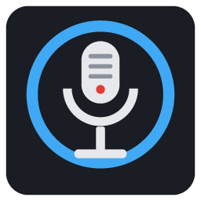

# Podcast Forge 8

A native Windows x64 console for podcast recording and monitoring: up to **8 independent USB
microphones** and **8 independent USB headphones**, each on its own channel, with per-channel DSP,
individual headphone mixes, crash-safe multitrack recording, a soundboard, music with automatic
ducking, talkback, and continuous drift correction between independently clocked USB devices.

<p align="center"></p>

## Features

- **8 mics × 8 headphones, one per person**: every USB device runs on its own clock; one device is
  the master and every other one is resampled continuously (PI-controlled, ±1000 ppm), so nothing
  drifts apart over a 3-hour show. Devices are remembered by Windows endpoint ID and USB serial —
  never by the order Windows lists them — and come back to their channel after a replug.
- **Channel strip**: trim, polarity, high-pass, gate, 4-band EQ, de-esser, compressor, limiter,
  reverb send, presets, and a mic setup wizard that measures noise and speech level.
- **Routing**: Main, Clean feed (mix-minus), Music, 8 headphone mixes (Main / Personal / Custom),
  PFL, solo-in-place on the monitor only, hearing-protection limiters on every headphone feed.
- **Recording**: one file per channel (post-DSP, sample-aligned to the Main mix) + Main mix + music;
  WAV / BWF / RF64 / FLAC, 16 / 24 / 32-bit float; crash-safe (journal + header checkpoints every
  2 s, recovery tool), never overwrites, keeps recording when the disk is nearly full and can
  continue on another drive; pre-roll buffer of 5–60 s; markers with CSV, Audacity labels,
  Adobe Audition and REAPER exports.
- **Soundboard** (24 carts), **music player** with auto-ducking under speech, **talkback** (hold or
  tap to latch) that can never reach the recording unless you allow it, **cough buttons**.
- **Hotkeys**: F9 record, F10 stop, F11 pause, F12 marker, Space start / stop, F8 talkback,
  Num 1–8 cough — all configurable, optionally global.
- **Projects** with every setting, carts and playlist; crash-restore of the working state; zip
  archive.
- **Diagnostics**: per-stream sync / drift / xruns, audio load, a tick watchdog that restarts the
  audio after a stall, disk speed test, JSON reports; `--e2e` self-test on the real devices.
- Windows audio effects (AGC, "enhancements") are bypassed on every stream (raw mode).

See [docs/LIMITATIONS.md](docs/LIMITATIONS.md) for what it does **not** do (e.g. no ASIO in 1.0, no
virtual audio driver of its own) and [docs/OBS.md](docs/OBS.md) for OBS / Discord / Zoom set-ups.

## Install

Download `PodcastForge8-<version>-Setup-x64.exe` (or the portable zip) from
[Releases](https://github.com/unupunct/Podcast-Forge-8/releases). Windows 10 (1809) or 11, x64. No
administrator rights needed. The files are not code-signed, so SmartScreen may ask once
(*More info → Run anyway*); compare the SHA-256 published with the release.

Projects are saved in `Documents\PodcastForge8\Projects`; settings and logs in
`%LOCALAPPDATA%\PodcastForge8`. Uninstalling never deletes them.

## Quick start

1. **DEVICE MATRIX**: drag each mic and each headphone onto its channel (or *AUTO ASSIGN* and
   confirm). Optionally assign Monitor and the Stream outputs.
2. **MIXER**: set names; per guest open CONFIG → *MIC SETUP WIZARD…*; check levels.
3. Press **F9** (or REC). Markers with **F12**. **F10** stops and finalises every file.

## Command line

| Option | |
|---|---|
| `--list-devices` | JSON dump of every audio endpoint |
| `--recover <session folder>` | rebuild the headers of an interrupted recording (audio is never changed) |
| `--e2e [--seconds=N] [--out=<dir>]` | end-to-end test on the real devices; never plays out loud; JSON report |
| `--verify-ui` | render every screen offscreen at 7 resolutions / scales and check the layout |

## Documentation

| Doc | Contents |
|---|---|
| [ARCHITECTURE](docs/ARCHITECTURE.md) | Modules, threads, UI↔engine contract, file layout |
| [AUDIO_ENGINE](docs/AUDIO_ENGINE.md) | Multi-device engine, master clock, drift control, latency |
| [ROUTING](docs/ROUTING.md) | Routing matrix, headphone mixes, solo / PFL, talkback |
| [DEVICE_MANAGEMENT](docs/DEVICE_MANAGEMENT.md) | Stable device identity, hot-plug, Device Matrix |
| [RECORDING](docs/RECORDING.md) | Crash-safe recording, journal, recovery, pre-roll, markers |
| [DSP](docs/DSP.md) | Channel strip, presets, mic wizard, ducking |
| [PROJECTS](docs/PROJECTS.md) | Projects, crash restore, hotkeys |
| [OBS](docs/OBS.md) | OBS, Discord, Zoom, remote guests |
| [TESTING](docs/TESTING.md) | Unit tests, engine harness, UI and end-to-end verification |
| [LIMITATIONS](docs/LIMITATIONS.md) | Known limitations |
| [CHANGELOG](docs/CHANGELOG.md) | Stage-by-stage history |

## Building from source

Requirements: Windows 10/11 x64, Visual Studio 2022 Build Tools (MSVC v143, Windows SDK,
"C++ CMake tools"), Git. Python 3 only to regenerate the icon.

```powershell
.\scripts\fetch-deps.ps1     # JUCE 8.0.15, Catch2 v3.16.0, SQLite 3.53.4 into third_party/
.\scripts\gate.ps1           # configure + Release x64 build + tests + offscreen UI check
.\scripts\gate.ps1 -Live     # also run the tests against real audio devices
.\scripts\package.ps1        # gate, then installer + portable zip into out\
```

`package.ps1` expects Inno Setup 6 in `tools\InnoSetup6` (a portable copy:
`innosetup-6.x.exe /CURRENTUSER /PORTABLE=1 /DIR=tools\InnoSetup6`).

## Privacy

No telemetry, no network code, no accounts. Audio leaves the machine only through the output
devices you assign. Logs (`%LOCALAPPDATA%\PodcastForge8\Logs`, 10 × 10 MB) never contain audio or
keystrokes.

## Licence

GNU Affero General Public License v3 — see [LICENSE](LICENSE). Built on [JUCE](https://juce.com)
(AGPLv3), [Catch2](https://github.com/catchorg/Catch2) (BSL-1.0, tests only) and
[SQLite](https://sqlite.org) (public domain).

Copyright (C) 2026 unupunct.
